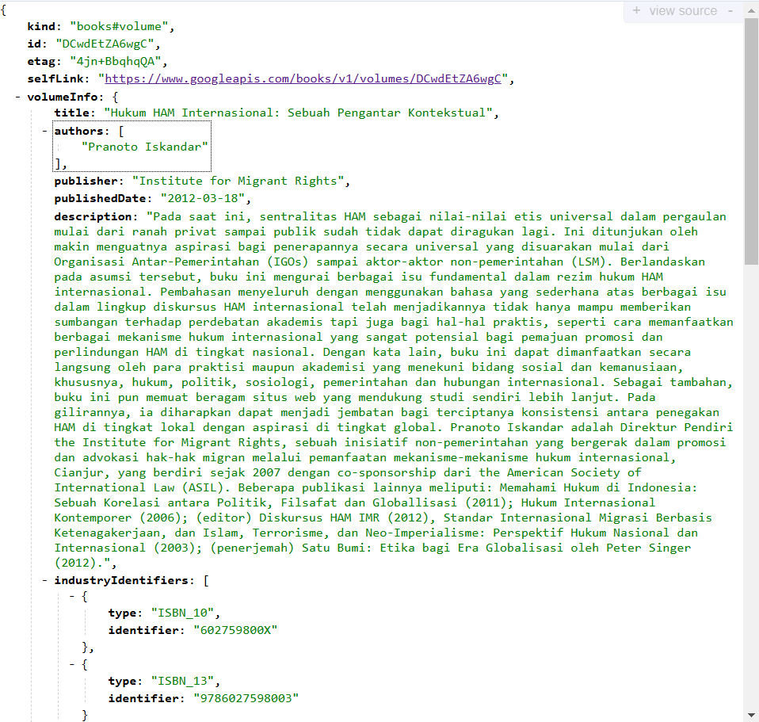
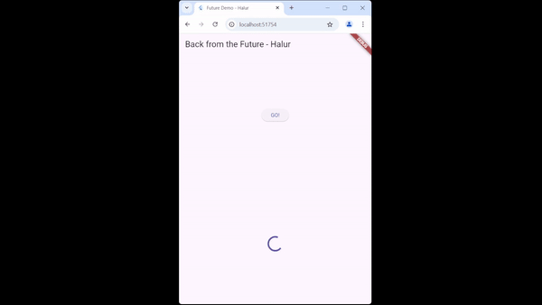
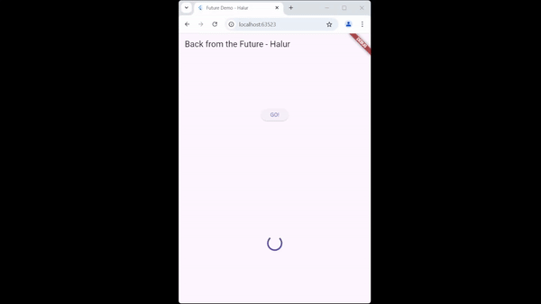
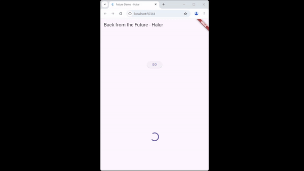

Nama : Halur Muhammad Abiyyu
 
Kelas : TI - 3H
 
NIM : 2141720072

# #11 | Pemrograman Asynchronous

## Praktikum 1 : Dasar State Dengan Model-View

## Soal 1

## Soal 2

## Soal 3

> Jelaskan maksud kode langkah 5 tersebut terkait substring dan catchError?   **Jawab**  
***substring()*** digunakan untuk mengambil sebagian teks dari sebuah string  
***catchError()*** digunakan untuk menangani error pada operasi asynchronous

## Soal 4

> Jelaskan maksud kode langkah 1 dan 2 tersebut  
**Jawab :**  
***Langkah 1*** adalah membuat tiga fungsi yang didalamnya terdapat fungsi untuk memberikan delay selama 3 detik. 
***Langkah 2*** adalah membuat fungsi untuk menghitung total dari ketiga fungsi yang sudah dibuat sebelumnya, jadi total tersebut berjumlah sembilan. Setelah mendapatkan total, tipe data total akan diconvert kedalam String. 

## Soal 5
> Jelaskan maksud kode langkah 2 tersebut!  
**Jawab :**  
Pada langkah 2 tersebut membuat variabel Completer sebagai variabel Lokal, di dalam fungsi getNumber() membuat Completer<int>() sebagai variabel lokal.
Completer digunakan untuk mengontrol penyelesaian dari sebuah Future secara manual. Pada fungsi calculate, memberi delay 5 detik dan memanggil completer pada fungsi tersebut.

