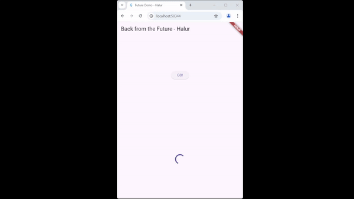
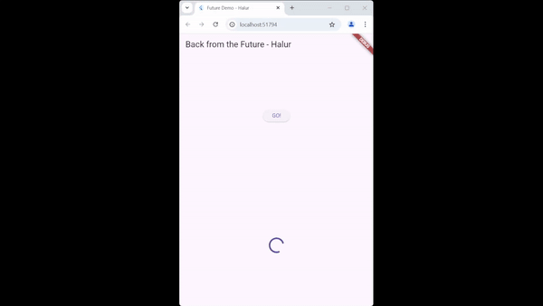
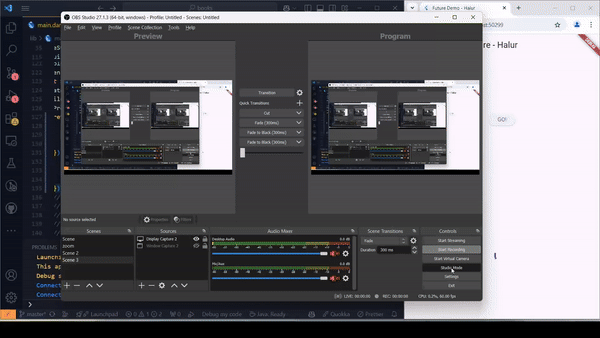

Nama : Halur Muhammad Abiyyu
 
Kelas : TI - 3H
 
NIM : 2141720072

# #11 | Pemrograman Asynchronous

## Praktikum 1 : Dasar State Dengan Model-View

## Soal 1

## Soal 2

## Soal 3

> Jelaskan maksud kode langkah 5 tersebut terkait substring dan catchError?   **Jawab**  
***substring()*** digunakan untuk mengambil sebagian teks dari sebuah string  
***catchError()*** digunakan untuk menangani error pada operasi asynchronous

## Soal 4

> Jelaskan maksud kode langkah 1 dan 2 tersebut  
**Jawab :**  
***Langkah 1*** adalah membuat tiga fungsi yang didalamnya terdapat fungsi untuk memberikan delay selama 3 detik. 
***Langkah 2*** adalah membuat fungsi untuk menghitung total dari ketiga fungsi yang sudah dibuat sebelumnya, jadi total tersebut berjumlah sembilan. Setelah mendapatkan total, tipe data total akan diconvert kedalam String. 

## Soal 5
> Jelaskan maksud kode langkah 2 tersebut!  
**Jawab :**  
Pada langkah 2 tersebut membuat variabel Completer sebagai variabel Lokal, di dalam fungsi getNumber() membuat Completer<int>() sebagai variabel lokal.
Completer digunakan untuk mengontrol penyelesaian dari sebuah Future secara manual. Pada fungsi calculate, memberi delay 5 detik dan memanggil completer pada fungsi tersebut.

## Soal 6
> Jelaskan maksud perbedaan kode langkah 2 dengan langkah 5-6 tersebut!  
**Jawab :**  
Perbedaannya adalah pada langkah 5-6 ditambahkan try catch untuk meng-handle error jika hasil berupa error  

## Soal 7

## Soal 8
> Jelaskan maksud perbedaan kode langkah 1 dan 4!  
**Jawab :**  
FutureGroup dan Future.wait keduanya digunakan untuk menjalankan beberapa operasi asinkron secara paralel, tetapi dengan cara yang berbeda. **Future.wait** fungsi yang menerima daftar Future dan menjalankannya secara paralel, dan menyelesaikan semuanya sebelum melanjutkan. Fungsi ini cocok jika semua Future sudah jelas di awal. **FutureGroup** digunakan untuk penambahan Future secara dinamis sebelum dipanggil close(), fungsi ini cocok jika Future tidak semuanya diketahui sejak awal. Jadi Gunakan Future.wait untuk solusi yang lebih sederhana dan efisien, dan gunakan FutureGroup untuk lebih fleksibel untuk skenario dinamis.

## Soal 9
  
