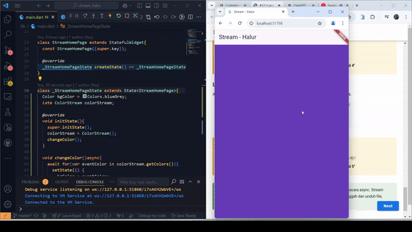

# #12 Stream

## Soal 1

## Soal 2

## Soal 3
Pada kode, yield* digunakan untuk meneruskan elemen-elemen dari Stream.periodic ke aliran getColors. Stream.periodic menghasilkan warna dari daftar colors secara berkala setiap 1 detik. Hasilnya adalah aliran warna yang berganti setiap detik secara berurutan dan berulang

## Soal 4

## Soal 5
Perbedaan utama antara listen dan await for dalam pengolahan Stream adalah pada cara kerja dan konteks penggunaannya. listen digunakan untuk mendaftarkan *listener* yang merespons setiap elemen yang dipancarkan oleh aliran tanpa *blocking*, cocok untuk pembaruan langsung seperti UI. Sementara itu, await for membaca elemen dari aliran secara berurutan dalam konteks fungsi async, bersifat *blocking* sehingga eksekusi menunggu elemen berikutnya sebelum melanjutkan. listen lebih fleksibel dengan dukungan fitur seperti onError dan onDone, sedangkan await for lebih cocok untuk logika iterasi yang terstruktur.