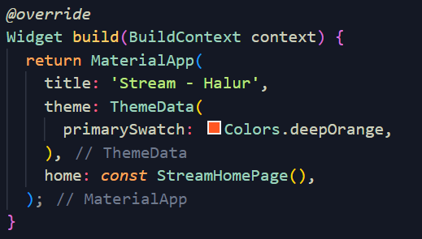
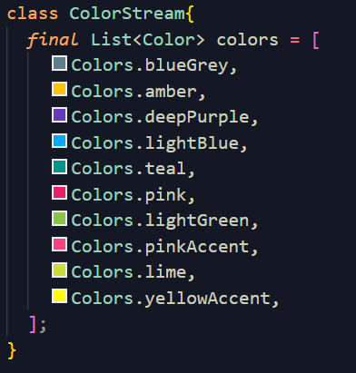
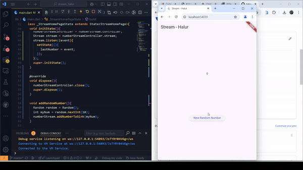

# #12 Stream

## Soal 1

## Soal 2

## Soal 3
Pada kode, yield* digunakan untuk meneruskan elemen-elemen dari Stream.periodic ke aliran getColors. Stream.periodic menghasilkan warna dari daftar colors secara berkala setiap 1 detik. Hasilnya adalah aliran warna yang berganti setiap detik secara berurutan dan berulang

## Soal 4

## Soal 5
Perbedaan utama antara listen dan await for dalam pengolahan Stream adalah pada cara kerja dan konteks penggunaannya. listen digunakan untuk mendaftarkan *listener* yang merespons setiap elemen yang dipancarkan oleh aliran tanpa *blocking*, cocok untuk pembaruan langsung seperti UI. Sementara itu, await for membaca elemen dari aliran secara berurutan dalam konteks fungsi async, bersifat *blocking* sehingga eksekusi menunggu elemen berikutnya sebelum melanjutkan. listen lebih fleksibel dengan dukungan fitur seperti onError dan onDone, sedangkan await for lebih cocok untuk logika iterasi yang terstruktur.

## Soal 6
Pada fungsi initState, sebuah instance NumberStream dan kontrolernya (numberStreamController) diinisialisasi untuk mengelola aliran data. Kemudian, aliran stream dipantau dengan listen, sehingga setiap data baru (angka) yang dipancarkan akan diterima dan memperbarui nilai lastNumber melalui setState, memungkinkan pembaruan UI secara langsung. Fungsi ini dijalankan saat inisialisasi awal widget.

Fungsi addRandomNumber digunakan untuk menambahkan angka acak ke aliran. Angka tersebut dihasilkan dengan Random, yang menghasilkan angka bulat antara 0 hingga 9, dan kemudian ditambahkan ke sink (aliran input) menggunakan metode addNumberToSink dari NumberStream, yang memicu aliran untuk memancarkan angka baru ke semua pendengar.  

