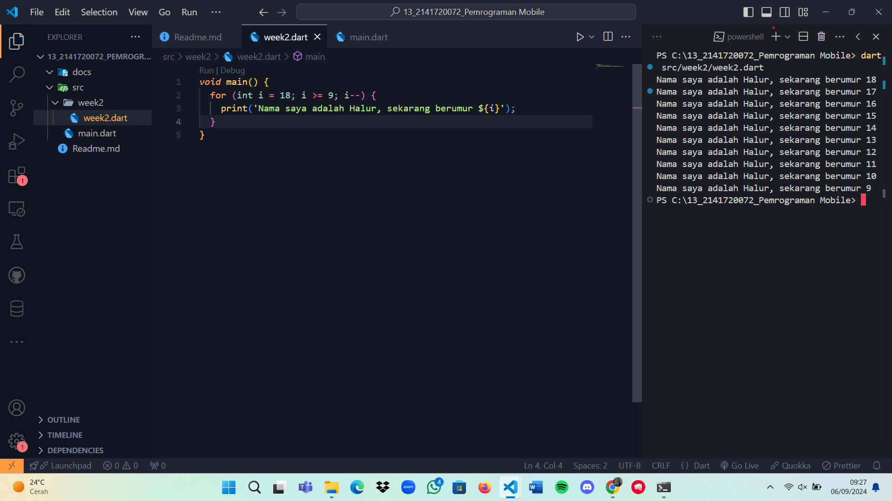

### Nama &ensp; : Halur Muhammad Abiyyu
### Kelas &ensp; : TI 3H
### NIM &ensp; : 2141720072



```bash
2. Karena memahami bahasa Dart itu dasar ilmu untuk sebelum menggunakan Flutter. Developer perlu mengetahui dasar-dasar bahasa Dart, bagaimana komunitas mengerjakannya, fitur fiturnya.
```

```
3. Fitur-fitur Dart
    - Productive tooling: fitur kakas (tool) untuk menganalisis kode, plugin.

    - Garbage collection: untuk mengelola atau menangani dealokasi memori

    - Type annotations : untuk keamanan dan konsistensi dalam mengontrol semua data dalam aplikasi.

    - Statically typed : Dart tetap aman karena menggunakan fitur type-safe dan type inference untuk menganalisis types saat runtime. Fitur ini penting untuk menemukan bug selama kompilasi kode.

    - Portability: Dart juga dapat dikompilasi secara native ke kode Advanced RISC Machines (ARM) dan x86

Bahasa Dart Bekerja
Kode Dart dapat dieksekusi pada lingkungan yang mendukung bahasa Dart. Lingkungan yang mendukung bahasa Dart perlu memperhatikan fitur-fitur penting seperti berikut:

 - Runtime systems
 - Dart core libraries
 - Garbage collectors

Eksekusi kode Dart dapat beroperasi dalam dua mode — kompilasi Just-In-Time (JIT) atau Kompilasi Ahead-Of-Time (AOT)

Object Orientation
Dart dirancang untuk object-oriented(OO). Sesuai prinsip Object-orientation memastikan bahwa Dart memiliki fitur encapsulation, inheritance, composition, abstraction, dan polymorphism.

Dart Operators
Di Dart, operator tidak lebih dari method yang didefinisikan dalam class dengan sintaks khusus.

Jadi, ketika menggunakan operator seperti x == y, seolah-olah Anda sedang memanggil x.==(y) metode untuk melakukan perbandingan kesetaraan.

Arithmetic Operators

 + untuk tambahan
 - untuk pengurangan
 * untuk perkalian
 / untuk pembagian
 ~/ untuk pembagian bilangan bulat

Increament and Decrement Operators
 
 ++var atau var++ untuk menambah nilai variabel var sebesar 1

 --var atau var-- untuk mengurangi nilai variabel var sebesar 1

Logical Operators

 !expression yaitu kebalikan hasil expresi

 || yaitu OR antara dua ekspresi

 && yaitu AND antara dua ekspresi

DartPad
Ini adalah kakas online yang bagus untuk belajar dan bereksperimen dengan fitur bahasa Dart.

Main Function
Dart menggunakan function dan method sebagai cara untuk memisahkan kode. Sebuah function atau method adalah potongan kode yang menerima beberapa data, eksekusi kode, dan kemudian mengembalikan beberapa data (return).

```