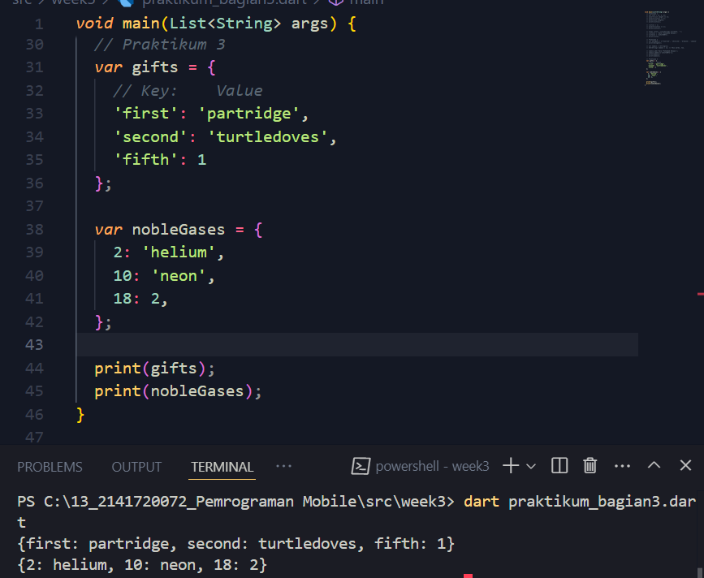

## **Laporan Praktikum**

### **Bagian 2**

#### Praktikum 1

- Langkah 1 <br>


- Langkah 2 <br>
**Apa yang terjadi?**
karena variabel test memiliki nilai string "test2" maka program akan mengecek pada kondisi if dan akan memasuki baris kode yang kondisinya sesuai, pada kode ini variabel memiliki kondisi dengan nilai yang sama dengan kondisi dua atau else if(test == "test2") maka akan mencetak "Test2".
Dan pada pengecekan paling akhir menggunakan if dengan satu baris, karena nilainya sesuai kondisi maka akan dicetak "Test2 again".

- Langkah 3 <br>


Pada saat pertama dijalankan, kode menunjukan hasil error karena variabel test sudah pernah dideklarasi dan karena variabel test merupakan tipe data string maka penulisan pada pengecekan kondisi belum benar . Kode dibenarkan dengan cara tidak mendeklarasikan ulang tipe data dari variabel dan hanya mengisikan nilai dengan "true". Pada pengecekan if, kondisi dalam pengecekan diubah menjadi test == "true". Maka kode akan berhasil dijalankan dan menghasilkan "kebenaran".

#### Praktikum 2

- Langkah 1 <br>


- Langkah 2 <br>
**Apa yang terjadi?**
Kode menghasilkan error karena variabel counter belum didefinisikan
Hasil Perbaikan Kode


- Langkah 3 <br>

Perulangan dengan do-while, yaitu perulangan yang setidaknya menghasilkan 1 perulangan karena pada do-while pengecekan dilakukan pada baris terakhir

#### Praktikum 3

- Langkah 1 <br>


- Langkah 2 <br>
**Apa yang terjadi?**
Kode terjadi error karena variabel index untuk perulangan belum didefinisikan dan index tidak increament yang akan menghasilkan angka yang sama pada setiap perulangan dan perulangan tidak akan berhenti.

Membenarkan kode dengan mendefinisikan variabel index dan melakukan increament agar tidak menghasilkan angka yang sama setiap perulangan dan perulangan bisa berhenti pada angka yang ditentukan.

- Langkah 3 <br>

Pada kode diatas, program tidak akan mencetak index karena jika index sama dengan 21 maka perulangan akan langsung dihentikan dan jika index lebih dari 1 atau index kurang dari 7 maka perulangan akan langsung menuju pada perulangan berikutnya. Pada kasus ini index memiliki nilai 10 yaitu berarti selalu lebih besar dari 1 dan akan menghasilkan nilai true pada pengecekan kedua maka kode untuk mencetak index tidak akan pernah dijalankan.

#### Tugas bagian 2 <br>
Buatlah sebuah program yang dapat menampilkan bilangan prima dari angka 0 sampai 201 menggunakan Dart. Ketika bilangan prima ditemukan, maka tampilkan nama lengkap dan NIM Anda


### **Bagian 3**
#### Praktikum 1
- Langkah 1 <br>


- Langkah 2 <br>
Kode diatas adalah untuk membuat list yang mempunyai nilai 1, 2, dan 3. Dan pada baris assert() yaitu untuk pengecekan apakah kondisinya benar

- Langkah 3 <br>


Pada sebelum perbaikan, nilai default null tidak bisa ditetapkan pada list yang bertipe data string. Memperbaiki kode dengan mengganti nilai null dengan string ''.

#### Praktikum 2 
- Langkah 1 <br>


- Langkah 2 <br>
Pada kode tersebut adalah membuat tipe data set dan memberikan nilainya, selanjutnya set tersebut dicetak

- Langkah 3 <br>


#### Praktikum 3
- Langkah 1 <br>



- Langkah 2 <br>
Kode tersebut untuk membuat tipe data maps yang mempunyai key dan nilai

- Langkah 3 <br>

Pada langkah ini, kode tambahan berguna untuk mengganti dan menambahkan nilai baru pada maps

#### Praktikum 4
- Langkah 1 <br>


- Langkah 2 <br>
Kode tersebut adalah melakukan spread pada list dan melakukan penambahan nilai pada list2 menggunakan spread operator dari list

- Langkah 3 <br>


- Langkah 4 <br>

Hasil jika promoActive bernilai true maka nilai 'Outlet' akan dimasukkan kedalam list dan jika bernilai false maka tidak dimasukkan kedalam list.

- Langkah 5 <br>

Kode tersebut berfungsi sama dengan langkah 4, yaitu melakukan pengecekan sebelum memasukan nilai kedalam list

- Langkah 6 <br>

Kode tersebut melakukan penambahan dari listOfInts ke dalam listOfString menggunakan perulangan didalam list

#### Praktikum 5
- Langkah 1 <br>


- Langkah 2 <br>
Kode tersebut membuat records dan menampilkannya pada console

- Langkah 3 <br>

Kode tersebut berfungsi untuk menukar nilai 

- Langkah 4 <br>

Membuat record dengan tipe anotasi didalam deklarasi variable

- Langkah 5 <br>

Membuat record bersifat immutable

#### Tugas Bagian 3

2. Functions adalah blok kode yang dapat dijalankan untuk melakukan suatu tugas tertentu. Sebuah function memungkinkan untuk menulis kode modular dan memudahkan dalam penggunaan kembali (reusability). Setiap function dapat menerima masukan dalam bentuk parameter dan menghasilkan keluaran.

3. - Positional Parameters (Required Parameters): Parameter yang wajib diisi ketika function dipanggil. <br> 
```dart
 void add(int a, int b) {
  print(a + b);
}
```
<br>

  - - Optional Positional Parameters: Parameter yang tidak wajib diisi dan biasanya diberikan nilai default atau null. <br>

```dart
void greet(String firstName, [String? lastName]) {
  print('Hello, $firstName $lastName');
}
```

- - Named Parameters: Parameter yang dipanggil dengan menyebut namanya saat memanggil function. Bisa dibuat opsional dengan tanda {}. 

```dart
void describePerson({required String name, int? age}) {
  print('Name: $name, Age: $age');
}
```
<br>

- - Default Parameters: Parameter yang memiliki nilai default jika tidak diberikan saat function dipanggil.
```dart
void multiply(int a, {int b = 2}) {
  print(a * b);
}
```

4. functions dalam Dart adalah first-class objects, artinya functions dapat disimpan dalam variabel, dikirim sebagai argumen, dan dikembalikan sebagai hasil dari fungsi lain.

```dart
void sayHello() {
  print('Hello!');
}

void executeFunction(void Function() func) {
  func(); // Menjalankan function yang diterima sebagai argumen
}

void main() {
  var myFunction = sayHello; // Function disimpan dalam variabel
  executeFunction(myFunction); // Function dikirim sebagai argumen
}
```

5. Anonymous functions (fungsi anonim) adalah fungsi yang tidak diberi nama. Mereka sering digunakan ketika fungsi hanya digunakan satu kali, terutama dalam situasi seperti callback atau higher-order functions.

```dart
(int x, int y) {
  return x + y;
};
```

6. - Lexical Scope: Konsep di mana variabel hanya dapat diakses dalam lingkup (scope) tempat mereka dideklarasikan. Lingkup ini bisa berupa fungsi atau blok kode.

```dart
void main() {
  var name = 'Dart';
  
  void greet() {
    print('Hello, $name'); // name bisa diakses karena berada dalam lingkup yang sama
  }
  
  greet(); // Output: Hello, Dart
}
```

- - Lexical Closures: Closure adalah fungsi yang bisa mengingat dan menggunakan variabel yang ada di lingkup (scope) di mana fungsi tersebut didefinisikan, meskipun lingkup itu sudah tidak aktif.

```dart
Function counter() {
  var count = 0;
  
  return () {
    count++;
    return count;
  };
}

void main() {
  var myCounter = counter();
  
  print(myCounter()); // Output: 1
  print(myCounter()); // Output: 2
}
```

7.  Return multiple value dengan list
```dart
List<int> getCoordinates() {
  return [10, 20];
}

void main() {
  var coordinates = getCoordinates();
  print('x: ${coordinates[0]}, y: ${coordinates[1]}');
}
```
